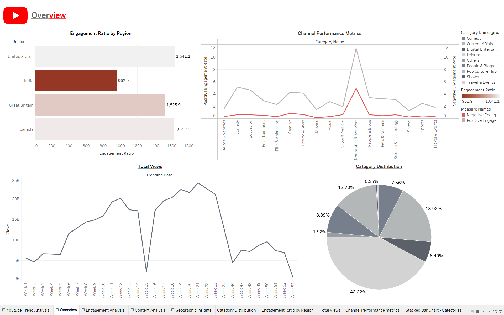
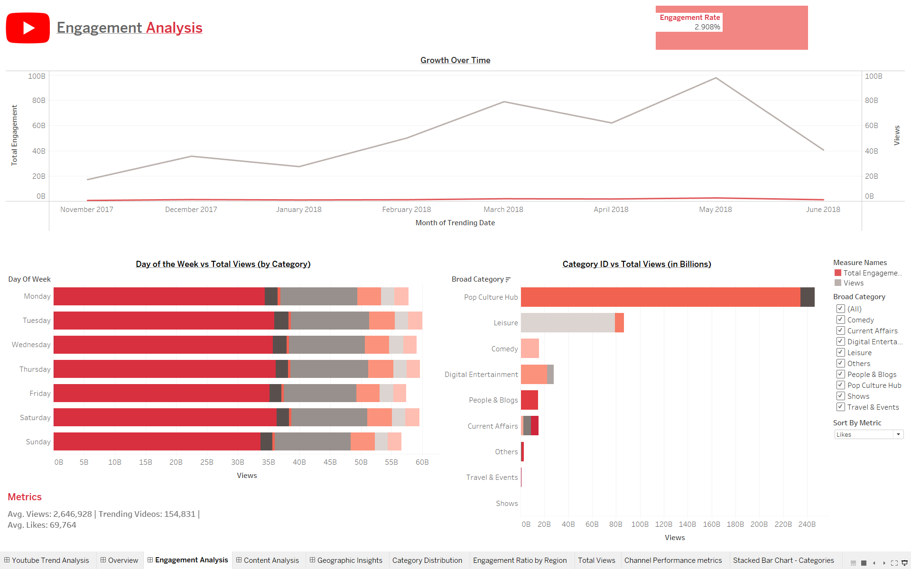
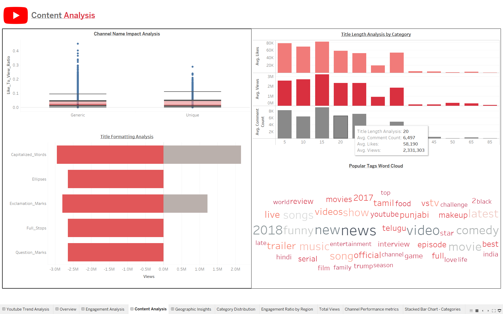
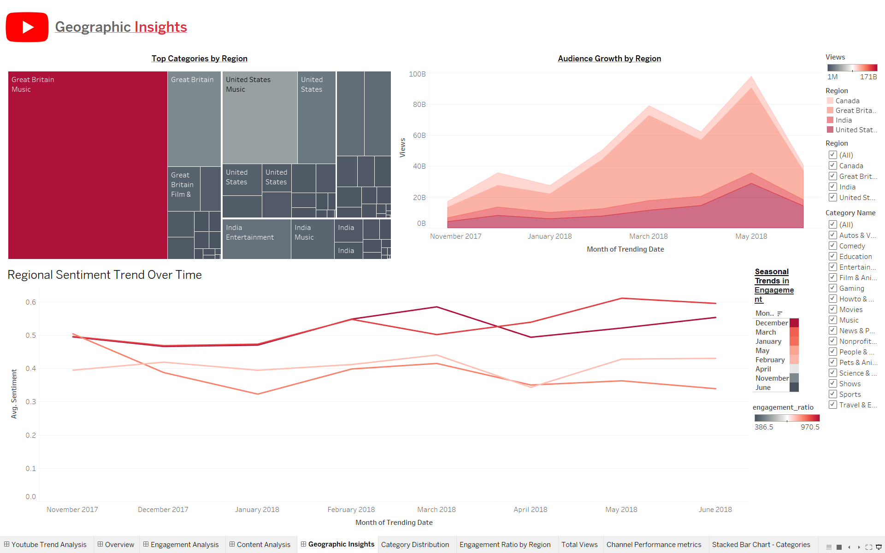

# 📺 YouTube Trends Analysis Dashboard  

This project develops an **interactive Tableau BI dashboard** to analyze **YouTube trending video data** and provide actionable insights for content creators. The goal is to help creators like **Alex Carter**, an emerging YouTuber, optimize their content strategy by understanding **engagement metrics, regional preferences, and trending content categories**.  

## Dashboard Screenshots

Here are some views from the dashboard:

*Main dashboard view showing overall YouTube trends.*

*Detailed analysis of top-performing channels.*

*Another view of dashboard analytics.*

*Additional dashboard details.*

---

## 📌 Project Overview  
The dashboard was designed to:  
1. Identify **category-specific engagement trends** (views, likes, comments).  
2. Analyze **regional differences** in audience sentiment and category performance.  
3. Evaluate **channel naming conventions, title formatting, and tag usage** to improve discoverability.  
4. Recommend **optimal publishing schedules** to maximize visibility and engagement.  

**Intended Users:** YouTube creators aiming to refine strategies and align content with high-performing trends.  

---

## 🔍 Methodology  

### 1. Data Preparation  
- Source: Kaggle *YouTube-New Dataset* (via YouTube API).  
- Preprocessing Steps:  
  - Appended regional data.  
  - Removed null values.  
  - Text preprocessing (tags, titles, descriptions).  
  - Created additional metrics (Engagement Ratio, Day-of-Week).  
  - Sentiment analysis on titles, tags, and descriptions.  
  - Text mining (TF-IDF) for channel and tag analysis.  

### 2. Dashboard Design (Tableau)  
- **Overview Dashboard**: High-level metrics (views, engagement ratio, category distribution).  
- **Geographic Insights**: Regional performance and sentiment trends.  
- **Content Analysis**: Channel name impact, title formatting effects, popular tags (word cloud).  
- **Engagement Analysis**: Day-of-week performance, category-wise breakdown of views and comments.  

### 3. Insights & Recommendations  
- **Category Trends**:  
  - Music dominates across regions.  
  - Comedy generates the most comments (audience interaction).  
  - Leisure content performs consistently well.  
- **Seasonal Trends**:  
  - December peak for leisure content.  
  - May peak for pop culture.  
- **Regional Preferences**:  
  - U.S. & U.K. drive music engagement.  
  - India shows more sentiment volatility (e.g., shows, travel).  
- **Audience Behavior**:  
  - Saturday is the **best day to publish** (highest views).  
  - Titles with punctuation (e.g., exclamation marks) improve visibility.  
- **Tags**: Popular ones like *“comedy”*, *“music”*, and *“trailer”* drive discoverability.  

---

## 🛠️ Tools & Technologies  
- **Data Processing**: Python (pandas, text mining, sentiment analysis)  
- **Visualization & BI**: Tableau  
- **Text Analytics**: TF-IDF, sentiment scoring, word clouds  

---

## 💡 Key Skills & Concepts  
- **Business Intelligence (BI)**  
- **Data Visualization (Tableau)**  
- **Text Mining & Sentiment Analysis**  
- **Engagement Analytics**  
- **Content Strategy Optimization**  

---

## 🚀 Key Takeaways  
- Data-driven insights help creators **choose categories, tags, and publishing times strategically**.  
- Regional and seasonal analysis provides **tailored content strategies**.  
- Visualization simplifies trend discovery, enabling creators to act on insights quickly.  

---
